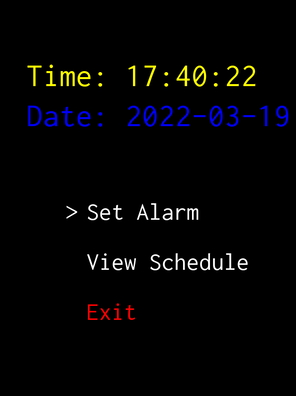

# pygame-alarm

An alarm clock made by beepboopblap

**Bugs and Putbacks**

- Can't create multiple alarms (working on it).
- Alarm will only sound if the pygame window is open

# Preview

# Usage

**Installation**

- Must have python and pygame installed
- Link to python installation guide: https://realpython.com/installing-python/
- Link to pygame installation guide: https://www.pygame.org/wiki/GettingStarted

**The App**

- When typing in the set alarm time
- Input the set times as **int** and not as a string

Examples

**Set Month?**: 03 (March)✅

**Set Day?**: 24 ✅

**Set Hour?**: 7pm ❌ 

**Set Day?**: Monday ❌ 

* *Please enter set hour in a 24 hour format*
